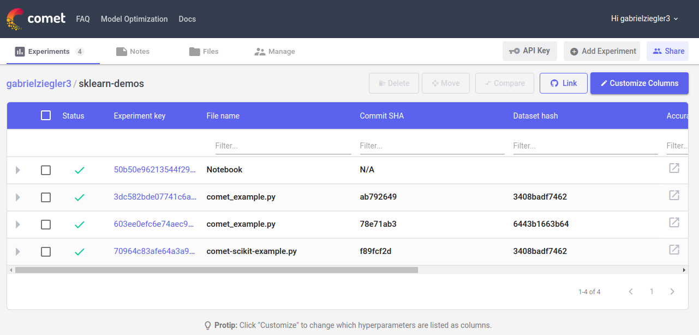
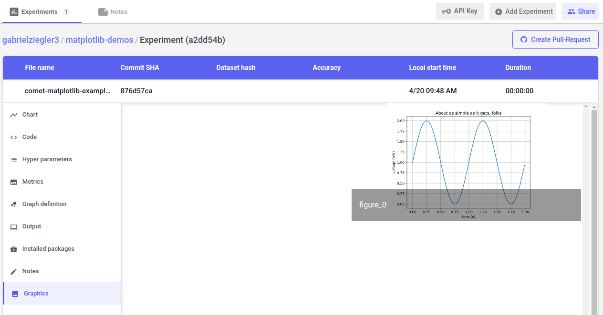

## Comet.ml

Rastreabilidade de projetos de Machine Learning

### Primeiro passo

Crie uma conta em [Comet](https://www.comet.ml/) e utilize sua chave API para rodar os exemplos.

[Scikit Learn Docs](https://www.comet.ml/docs/python-sdk/scikit/)

[Tracking experiment Docs](https://www.comet.ml/docs/python-sdk/Experiment/#experiment__init__)

Execute os exemplos com `python3 example.py`

O gráfico do experimento matplotlib-example ficará salvo na aba de `Graphics` do seu projeto.

**Nota**: O comet.ml tem maior compatibilidade para funcionar com projetos de ML em arquivos `.py`. Os projetos que utilizam do `jupyter notebook` possuem menos funcionalidades do comet.ml até o momento.

### Conteúdos úteis

* [Comet Github](https://github.com/comet-ml/issue-tracking)

* [Comet Docs](https://www.comet.ml/docs/)

* [How I monitor and track my machine learning experiments anywhere](https://towardsdatascience.com/how-i-monitor-and-track-my-machine-learning-experiments-from-anywhere-described-in-13-tweets-ec3d0870af99)

### Exemplos de uso

#### Projeto sklearn-demos

Experimentos gerados a cada vez que o projeto for executado



As informações que serão registradas no commit do experimento são descritas na chamada dos métodos do tipo `log` da classe `Experiment`.

No projeto sklearn-demos, os logs utilizados foram:

```python
exp.log_dataset_hash(X_train_scaled)
exp.log_multiple_params(params)
exp.log_multiple_metrics(metrics)
```

#### Projeto matplotlib

Gráfico registrado na aba de `Graphics` com método `log_feature`:

```python
experiment.log_figure(figure=plt)
```


